# Resultados de la sesión de lab — Arc-Linux end-to-end

> Fecha: **2026-06-21 → 2026-06-22 (01:30 UTC+2)**
> Operador: @chapi-dev
> Sub: `ME-MngEnvMCAP184496-antonioch-1`
> RG: `rg-arc-linux-lab` (westeurope)

## TL;DR — Petición original del correo del cliente

| Requisito del correo | Estado en el lab | Evidencia |
|---|---|---|
| 🔄 **Eliminar updates manuales** ("cosa que me gustaría poder evitar") | ✅ AUM con maintenance config R0 weekly + dynamic scope por tags | `G0-portal-aum-machines-dynamicscope-applied.png` |
| 🛡️ **Valorar Defender en lugar de Trend Micro** | ✅ Plan 2 ON + MDE.Linux active mode con RTP + EICAR detectado | `H6-rhel-eicar-quarantined.png` |
| 📂 **File Integrity Monitoring en Linux Defender** | ✅ Configurado con set "Recommended to monitor" + LAW `law-arc-linux-lab`. Eventos pendientes (lleva 30-90 min) | `H2a-portal-fim-configured.png` |
| 📦 **Inventario automatizado** (hoy manual) | ✅ Tags + Resource Graph + AMA en LAW | `E3c-portal-rhel-tags.png` |
| 👥 **Replicar los 3 grupos de Wintel** (`AZURE-ARC`, `AZURE-ARC-UPDATE`, `AZURE-ARC-DEFENDER`) | ✅ Implementados como combinación de **tags + dynamic scopes + Azure Policy** | docs/02-groups-and-tags.md |

---

## Lo que tienes desplegado y vivo

### Infra (RG `rg-arc-linux-lab`)
- **Log Analytics Workspace** `law-arc-linux-lab` (Pay-as-you-go, 30 d retention, 5 GB/d cap).
- **Data Collection Rule** `dcr-arc-linux-lab-syslog` (syslog auth+daemon+kern+local0-7, levels Info-Emergency).
- **3 Maintenance Configurations** (Tue R0 / Thu R1 / Sat-biweekly R2), duración 3h30, scope InGuestPatch.
- **3 Dynamic Scopes** filtrando por `ring=Rx + aum=enabled`.
- **3 Azure Policy assignments** con MI + roles: AMA, MDE, patchmode (audit).

### VMs del lab
| VM | OS | IP pública | Arc-connected | MDE | FIM | AUM |
|---|---|---|---|---|---|---|
| `lab-rhel9-01` | RHEL 9.8 | 20.224.141.21 | ✅ | ✅ Active | ✅ Pendiente eventos | ✅ R0 |
| `lab-ubuntu22-01` | Ubuntu 22.04.5 | 20.71.170.239 | ⏳ Pendiente | ⏳ | ⏳ | ⏳ |

### Tags aplicados a `lab-rhel9-01` (Arc resource)
```
os=linux
osFamily=rhel
env=lab
ring=R0
owner=platform-linux
app=none
mdfc=enabled
aum=enabled
criticality=tier3
managedBy=arc-linux-portal
```

### Defender for Servers Plan 2 — componentes activos
- ✅ Endpoint protection (MDE.Linux)
- ✅ Vulnerability assessment for machines
- ✅ Agentless scanning for machines
- ✅ **File Integrity Monitoring** (set "Recommended to monitor", workspace `law-arc-linux-lab`)
- ✅ Guest Configuration agent (preview)
- ❌ Log Analytics agent (deprecation path — usamos AMA)

### MDE.Linux en `lab-rhel9-01`
```
healthy: true
licensed: true (Plan 2)
org_id: 5d65bc45-3c3f-4e98-a1ca-239ae48f65df
release_ring: Production
app_version: 101.26032.0000
engine_version: 1.1.26040.3001
real_time_protection_enabled: true
real_time_protection_subsystem: fanotify
supplementary_events_subsystem: ebpf
behavior_monitoring: enabled
passive_mode_enabled: false
network_protection_enforcement_level: disabled  ← consciente, ver lessons-learned
definitions_status: up_to_date (v1.453.214.0)
edr_device_tags: AzureResourceId + SecurityWorkspaceId
```

### Prueba EICAR (validación AV)
```
Detection time: Sun Jun 21 23:17:07 2026
Name: Virus:DOS/EICAR_Test_File
Type: virus
status: quarantined  ✅
Path: /tmp/eicar.com
sha256: 275a021bbfb6489e54d471899f7db9d1663fc695ec2fe2a2c4538aabf651fd0f
```

### Eventos FIM preparados (pendientes de aparecer mañana)
- Modify `/etc/passwd` (touch) → HIGH severity
- Modify `/etc/ssh/sshd_config` (append marker) → MEDIUM
- Create `/etc/ssh/sshd_config.bak.<ts>` → MEDIUM
- Create `/etc/lab-arc-demo/config.txt` → (solo si la regla custom estaba activa)

Para validarlos mañana: `pwsh -File scripts\validate\01-validate-fim-events.ps1`.

---

## Capturas de la sesión

Ver `session/screenshots/README.md` para la descripción completa de cada captura.

### 📷 Galería end-to-end (orden cronológico del lab)

#### Bloque D — Preparación de la VM (des-azurización)

**D0a — Estado inicial de RHEL antes del lab:**
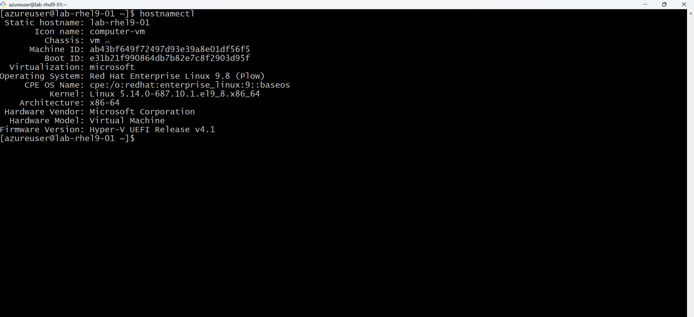

**D1 — Script `02-deazure-vm.sh` ejecutado:**
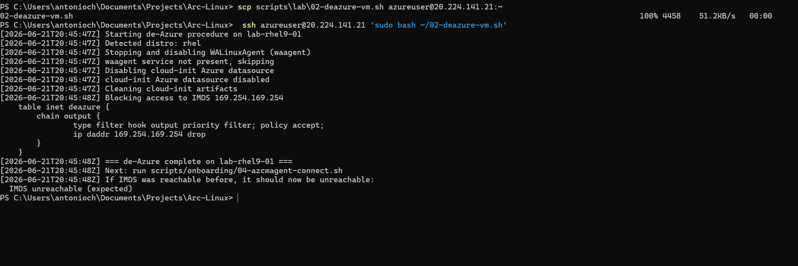

#### Bloque E — Onboarding a Azure Arc

**E2 — `OnboardingScript.sh` instalando azcmagent:**
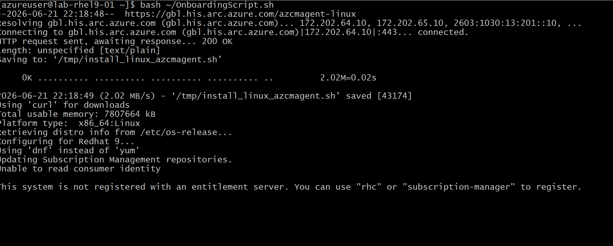

**E2b — Successfully Connected:**
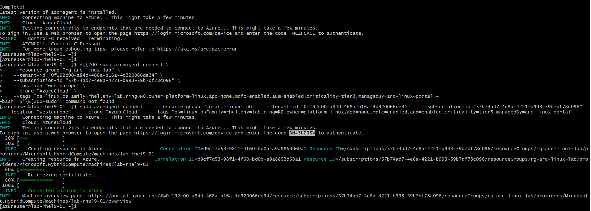

**E3 — `azcmagent show` con Agent Status = Connected:**
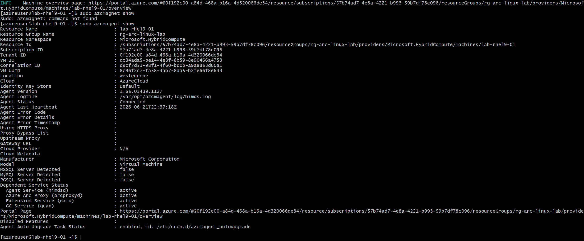

**E3a — Lista de máquinas Arc en portal:**
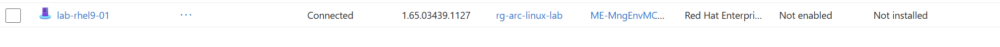

**E3b — Overview de `lab-rhel9-01`:**
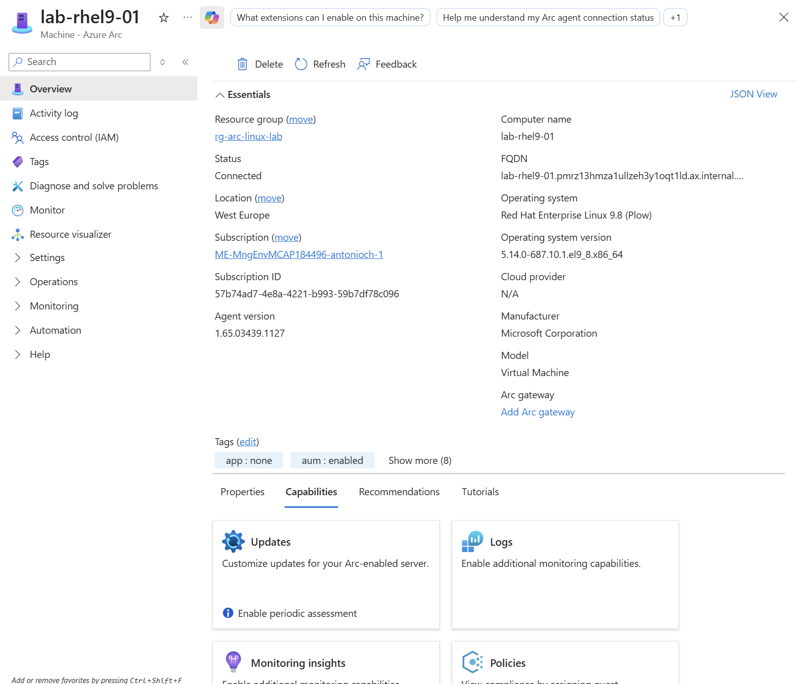

**E3c — 10 tags aplicados (pertenencia a los 3 grupos):**
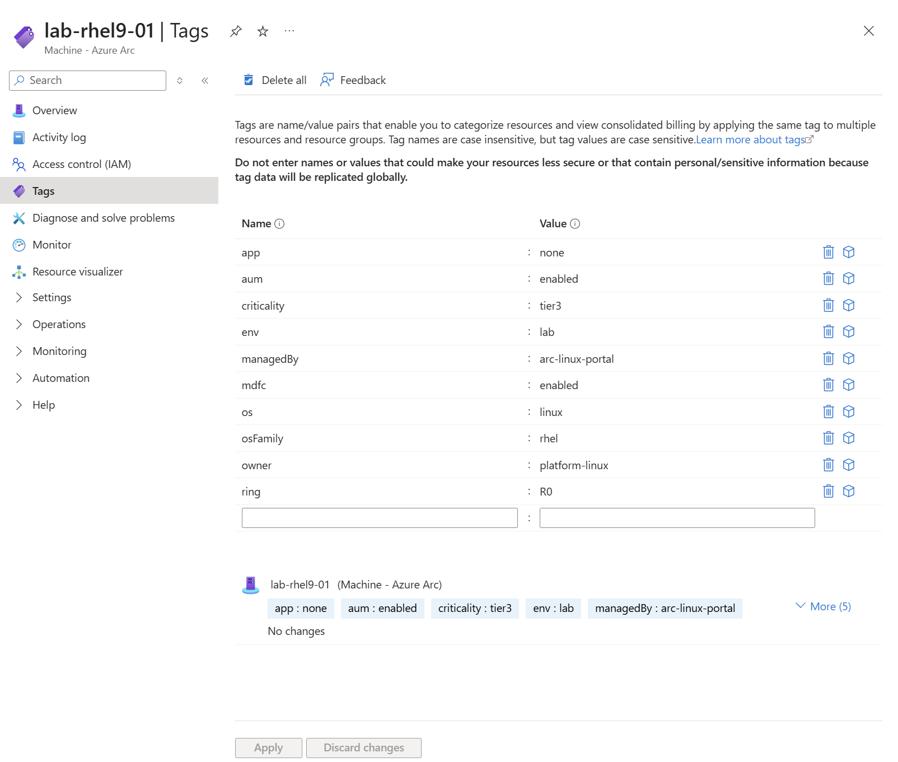

#### Bloque G — Azure Update Manager

**G0 — Dynamic scope aplicado (Associated configurations: 1):**
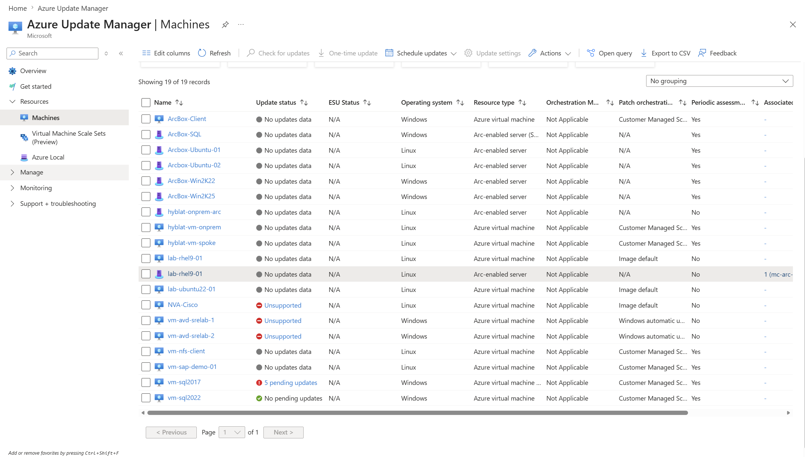

**G1a — Aviso en bulk panel: "Patch orchestration not applicable to Arc":**
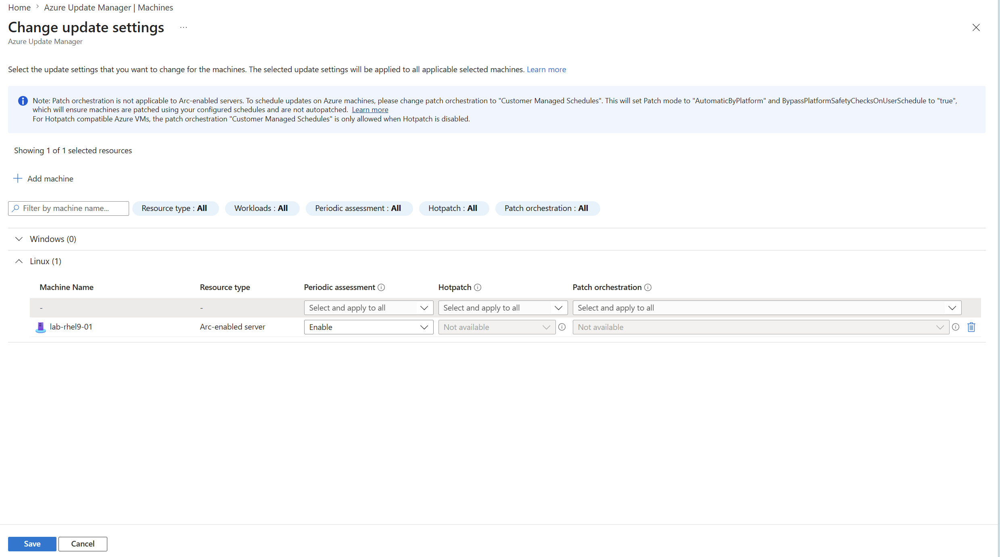

**G1b — Periodic assessment Enable (current):**
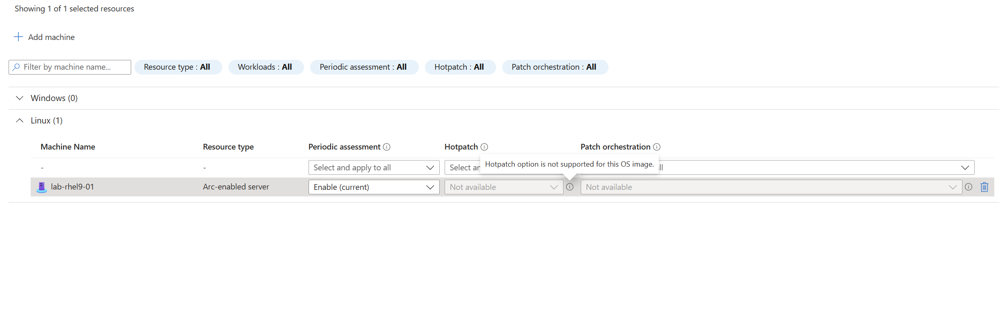

#### Bloque H — Defender for Servers (MDE + FIM)

**H1 — Defender plans con Servers Plan 2 ON:**
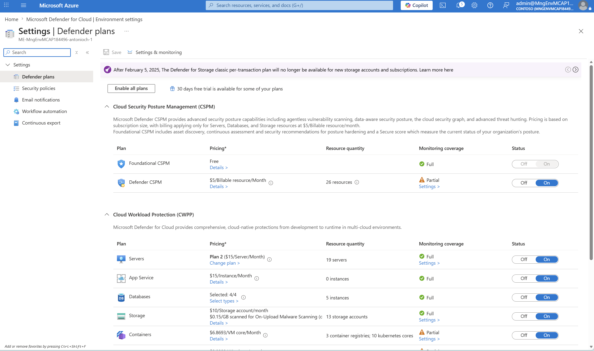

**H2 — Tabla de componentes del plan Servers:**
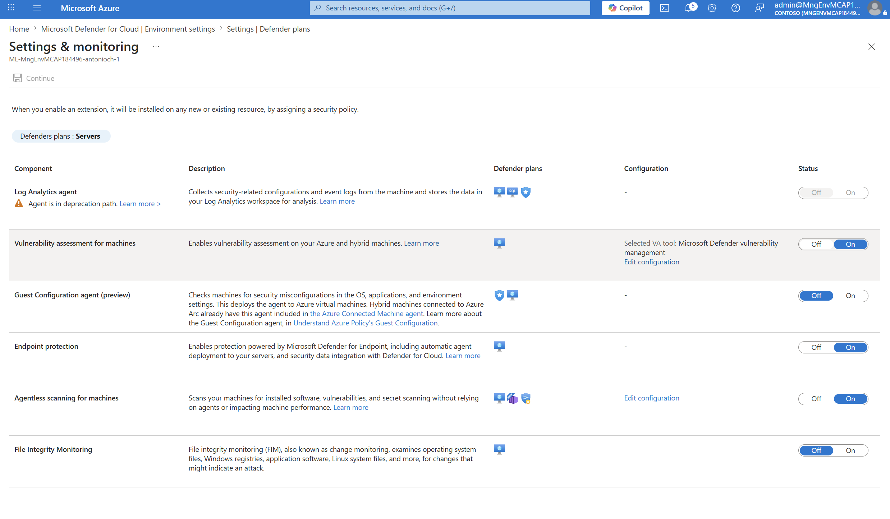

**H2a — Panel FIM configuration (antes del workspace):**


**H2b — Workspace `law-arc-linux-lab` seleccionado + Recommended Enabled:**
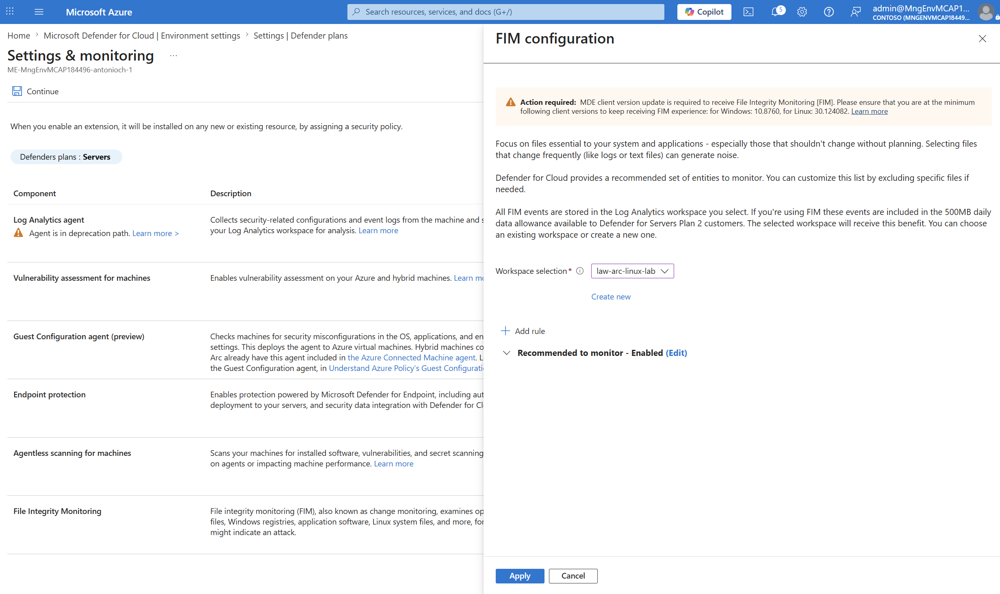

**H3 — `mdatp health` inicial (passive mode por defecto):**
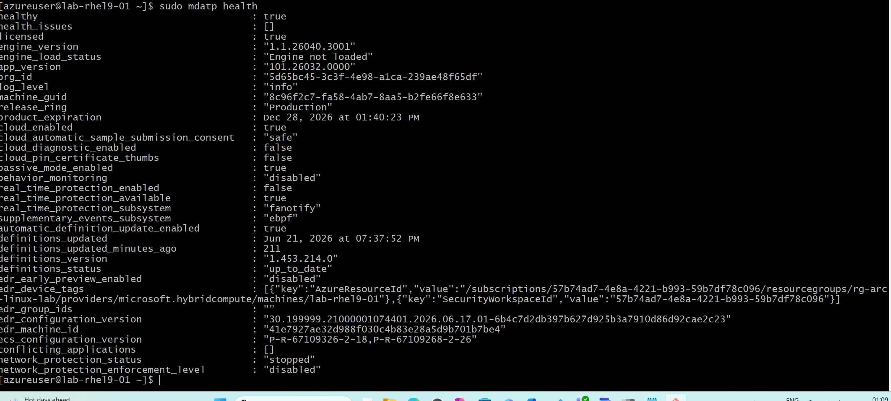

**H4 — Tras activar active mode (Network Protection falla por release ring):**
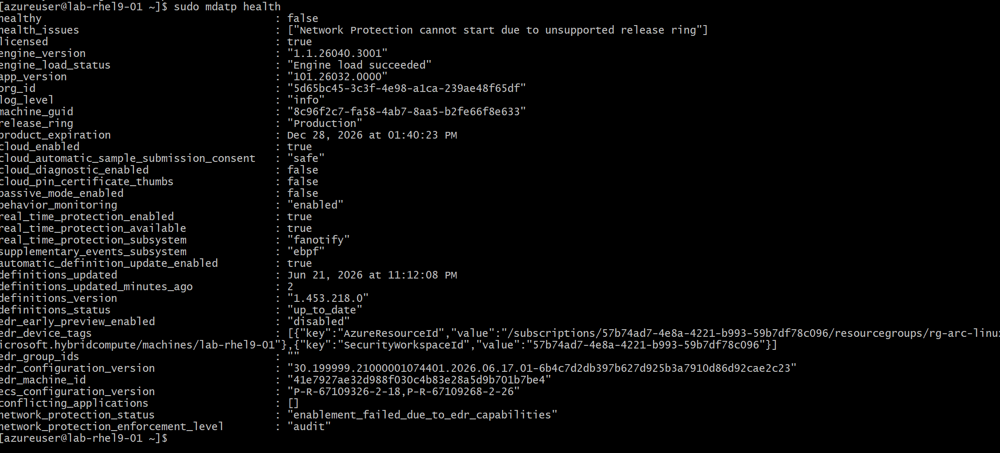

**H5 — `healthy: true / health_issues: []` tras deshabilitar Network Protection:**
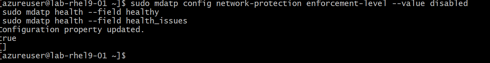

**H6 — 🏆 EICAR detectado y puesto en cuarentena (MDE operativo):**
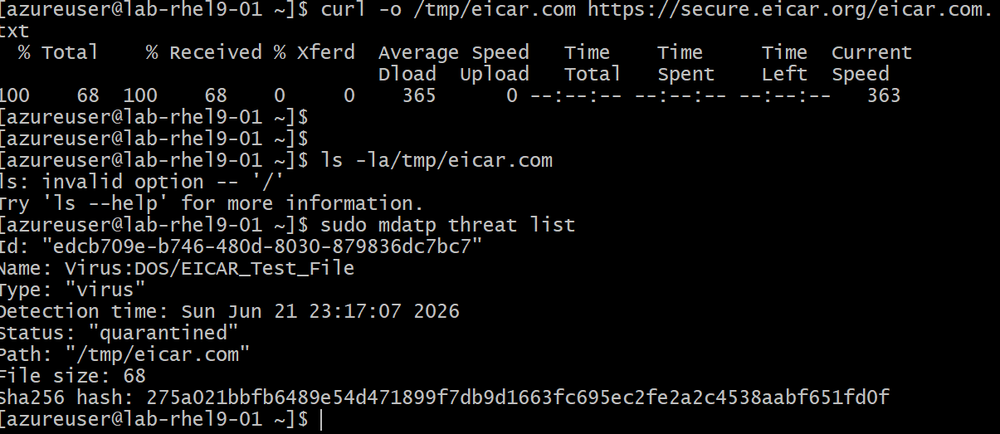

**H7 — Cambios FIM preparados para mañana:**
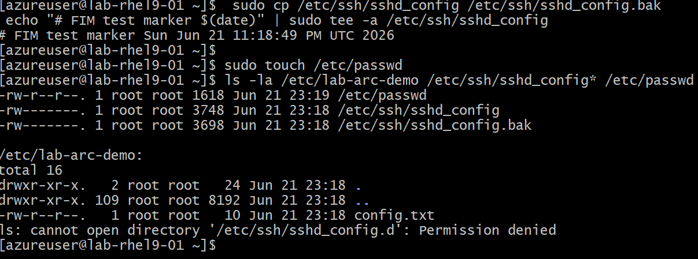

---

**Highlights resumen:**

| ID | Qué muestra | Por qué importa |
|---|---|---|
| `D1-rhel-deazure-output.png` | VM "azure-ized → on-prem-like" | Demuestra el script `02-deazure-vm.sh` antes del onboarding |
| `E2b-rhel-successfully-connected.png` | "Connected machine to Azure" | Onboarding manual con device code |
| `E3a-portal-arc-machines-list.png` | VM en la lista de Arc machines | Inventario funcionando |
| `E3c-portal-rhel-tags.png` | 10 tags aplicados | Pertenencia a grupos por tag |
| `G0-portal-aum-machines-dynamicscope-applied.png` | "Associated configurations: 1" | Dynamic scope captó la VM sola por tags |
| `H6-rhel-eicar-quarantined.png` | `mdatp threat list` con EICAR | **Antivirus 100% operativo, sustituye Trend Micro** |
| `H2a-portal-fim-configured.png` | FIM con LAW y set Recommended | FIM activo (eventos llegarán mañana) |

---

## Decisiones pendientes para la sesión con el cliente

1. **¿Convivencia o reemplazo de Trend Micro?**
   - Si reemplazo: desinstalar Trend antes de desactivar `passive_mode_enabled` en cada host.
   - Si convivencia (puente): dejar MDE en `passive_mode_enabled=true` (sólo informa).

2. **¿Ring layout final?** El lab usa R0 weekly. Sugerencia para prod:
   - R0 = piloto (5% del parque, criticality=tier3)
   - R1 = stage (35%, tier2, +4 días)
   - R2 = prod (60%, tier1, +10 días)

3. **¿Activar Defender Plan 2 en toda la sub?** Coste ~$15/host/mes. En la sub actual ya hay **19 servers en Plan 2** (~$285/mes). El lab cierra sin coste extra si se hace cleanup.

4. **¿Network protection en MDE.Linux?**
   - Hoy requiere **release_ring=Insider-Fast** (no recomendable para prod).
   - Recomendación: dejar `disabled` hasta que Microsoft lo soporte en Production ring.

5. **¿Onboarding masivo: device code (manual) o Service Principal?**
   - Lab: device code (simple).
   - Prod: SP con secret en Key Vault, federated credentials para CI/CD. Ver `docs/06-onboarding-authentication.md`.

6. **¿FIM custom rules?** El set Recommended cubre lo crítico de Linux (passwd, sshd_config, cron, init.d, binarios sistema). En prod añadir paths de apps internas (`/opt/<app>/conf`, etc.).

---

## Próximos pasos (día +1)

- [ ] Validar eventos FIM en portal y con KQL (`scripts/validate/01-validate-fim-events.ps1`).
- [ ] Capturar `I3b-portal-defender-fim-events.png`.
- [ ] Repetir bloques D-E con `lab-ubuntu22-01` (sugerir `ring=R1` para mostrar 2 anillos funcionando).
- [ ] Workbook custom o queries Resource Graph para vista global (ver `queries/resource-graph.kql`).
- [ ] Limpieza del lab (`scripts/deploy/cleanup.ps1`) tras la sesión con el cliente.

---

## Gotchas descubiertas durante el lab (todas documentadas en `docs/07-lab-lessons-learned.md`)

1. **JIT VM Access** de Defender for Cloud sustituye reglas SSH custom por `DenyAll:22`. Solución: regla manual con prio 1000 (script `scripts/lab/reopen-ssh.ps1`).
2. **CRLF en scripts .sh** rompe bash en Linux. Solución: `.gitattributes` con `*.sh text eol=lf`.
3. **RHEL PAYG en Azure** muestra "Unable to read consumer identity" en dnf — normal, usa RHUI.
4. **Bicep CLI en Windows**: `--outfile NUL` falla. Usar `--stdout > $null`.
5. **Azure CLI `application-insights` extension** rota bloquea `az connectedmachine update`. Workaround: `az rest` directo.
6. **AUM bulk panel**: para Arc-enabled servers la columna "Patch orchestration" sale `Not available`. Solo `assessmentMode` se puede en bulk. `patchMode` se configura por VM o por API.
7. **MDE.Linux Network Protection** requiere `release_ring=Insider-Fast`. En Production ring sale `enablement_failed_due_to_edr_capabilities`. Dejar disabled.
8. **MDE en passive mode por defecto**. Hay que activar `passive_mode_enabled=false` + `real_time_protection=enabled` + `behavior_monitoring=enabled` para que sustituya a Trend Micro.
