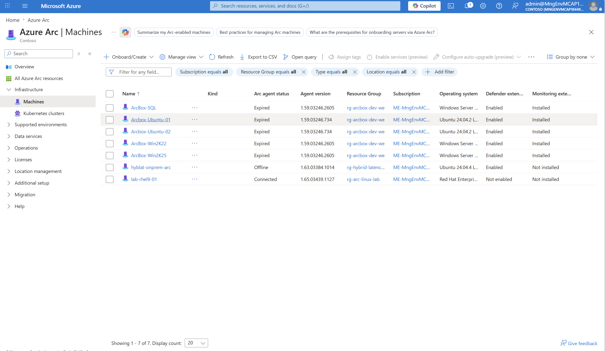

# Galería de capturas — Lab Arc-Linux

> Convención de naming: `<BLOQUE><N>[<sub>]-<descripcion-corta>.png`
>
> | Bloque | Tema |
> |---|---|
> | **D** | Des-azurización (preparar VM como si fuera on-prem) |
> | **E** | Onboarding a Azure Arc + verificación de tags |
> | **G** | Azure Update Manager — `AZURE-ARC-UPDATE` |
> | **H** | Defender for Servers + MDE.Linux + FIM — `AZURE-ARC-DEFENDER` |
> | **I** | Validación end-to-end (día +1, pendiente) |

---

## Bloque D — Preparación de la VM Linux

### `D0a-rhel-hostnamectl-before.png`
Estado inicial: RHEL 9.8 Plow, kernel 5.14.0-687.10.1.el9_8.x86_64.


### `D1-rhel-deazure-output.png`
Output del script `scripts/lab/02-deazure-vm.sh`. La VM se "finge" on-prem
(walinuxagent fuera, metadata bloqueada).


---

## Bloque E — Onboarding a Azure Arc

### `E2-rhel-azcmagent-install-progress.png`
`OnboardingScript.sh` instalando el azcmagent. Los mensajes "Unable to read
consumer identity" son **normales** en RHEL PAYG (usa RHUI gestionado por
Azure, no Subscription Manager).


### `E2b-rhel-successfully-connected.png`
"Successfully Onboarded Resource to Azure" — conexión completada.


### `E3-rhel-azcmagent-show.png`
`azcmagent show` con **Agent Status = Connected**.


### `E3a-portal-arc-machines-list.png` y `E3a-portal-arc-machines-full-list.png`
`lab-rhel9-01` ya en la lista de Arc machines del portal.




### `E3b-portal-rhel-overview.png`
Página overview del recurso Arc con detalles de la VM.


### `E3c-portal-rhel-tags.png`
Los **10 tags** aplicados durante el onboarding. La pertenencia a los 3 grupos
del cliente se materializa con tags:
- `AZURE-ARC` ← `os=linux`, `osFamily=rhel`, `env=lab`, `criticality=tier3`, `managedBy=arc-linux-portal`
- `AZURE-ARC-UPDATE` ← `aum=enabled` + `ring=R0`
- `AZURE-ARC-DEFENDER` ← `mdfc=enabled`


---

## Bloque G — Azure Update Manager (`AZURE-ARC-UPDATE`)

### `G0-portal-aum-machines-dynamicscope-applied.png`
La fila `lab-rhel9-01` muestra **`Associated configurations: 1
(mc-arc-linux-lab-r0-weekly)`**. **Sin tocar nada manualmente** — el dynamic
scope `ds-arc-linux-r0` capturó la VM automáticamente por sus tags
`ring=R0 + aum=enabled`. Esta es la magia del modelo de grupos.


### `G1a-portal-aum-change-update-settings-warning.png`
Aviso azul en el panel bulk **Change update settings** explicando que
"Patch orchestration is not applicable to Arc-enabled servers". Es el
**gotcha #6** documentado en `docs/07-lab-lessons-learned.md`: el bulk panel
solo permite cambiar Patch orchestration en Azure VMs nativas. Para Arc hay
que hacerlo por VM o vía API (lo que hicimos en el lab con `az rest`).


### `G1b-portal-aum-periodic-assessment-enabled.png`
`Periodic assessment: Enable (current)` ya aplicado. Las columnas Hotpatch y
Patch orchestration salen `Not available`/`Not supported`:
- **Hotpatch** = solo Windows Server 2022 Datacenter Azure Edition.
- **Patch orchestration** = limitación del bulk panel en Arc (ver `G1a`).


---

## Bloque H — Defender for Servers + MDE.Linux + FIM (`AZURE-ARC-DEFENDER`)

### `H1-portal-defender-plans-servers-p2-on.png`
Página **Defender plans**. La fila **Servers** está en **Plan 2 ($15/Server/Month)
ON** con **Monitoring coverage Full** y **19 servers cubiertos** (incluye Arc
+ Azure VMs de la sub). Esto cubre el "valorar Defender" del correo.


### `H2-portal-defender-servers-components-before.png`
Tabla **Settings & monitoring** del plan Servers. Estado inicial del lab:
| Componente | Estado |
|---|---|
| Log Analytics agent | Off (deprecated, usamos AMA via DCR) |
| Vulnerability assessment | **On** |
| Guest Configuration agent | Off → activado después |
| Endpoint protection (MDE) | **On** |
| Agentless scanning | **On** |
| File Integrity Monitoring | Off → activado después |


### `H2a-portal-fim-configuration-panel.png`
Panel **FIM configuration** al activar el toggle de FIM. Pide workspace
destino y muestra "Recommended to monitor — Enabled" (set por defecto curado
por Microsoft: passwd, shadow, sudoers, sshd_config, cron, init.d, binarios
sistema, etc.). Aviso superior: MDE Linux versión mínima requerida = 30.124082.


### `H2b-portal-fim-workspace-selected.png`
FIM configuration con **`law-arc-linux-lab` seleccionado** como workspace
destino y el set Recommended Enabled. Listo para Apply.


### `H3-rhel-mdatp-health-initial-passive.png`
`sudo mdatp health` justo después del despliegue automático de la extensión
MDE.Linux por Defender for Cloud. **Estado por defecto = passive mode**
(Microsoft despliega así para coexistir con otros AVs como Trend Micro):
- `passive_mode_enabled: true`
- `real_time_protection_enabled: false`
- `engine_load_status: "Engine not loaded"`

Aún así ya muestra `licensed: true`, `org_id` correcto, y `edr_device_tags`
con `AzureResourceId` + `SecurityWorkspaceId` (vinculado a Arc + LAW).


### `H4-rhel-mdatp-network-protection-error.png`
Tras pasar MDE a active mode:
```bash
sudo mdatp config passive-mode --value disabled
sudo mdatp config real-time-protection --value enabled
sudo mdatp config behavior-monitoring --value enabled
sudo mdatp config network-protection enforcement-level --value audit
```

Casi todo correcto (`passive=false`, `RTP=true`, `engine loaded`,
`behavior_monitoring=enabled`) **excepto Network Protection**:
- `health_issues: ["Network Protection cannot start due to unsupported release ring"]`
- `network_protection_status: "enablement_failed_due_to_edr_capabilities"`

Causa: Network Protection en MDE.Linux requiere `release_ring=Insider-Fast`,
no funciona en `Production` ring (el recomendado para prod). Ver
`docs/07-lab-lessons-learned.md` punto 7.


### `H5-rhel-mdatp-healthy-true.png`
Tras `sudo mdatp config network-protection enforcement-level --value disabled`:
- `healthy: true` ✅
- `health_issues: []` ✅

**MDE.Linux 100% operativo** para AV + EDR + telemetría a Defender XDR.


### `H6-rhel-eicar-quarantined.png`
🏆 **Captura clave para la presentación al cliente.** Validación end-to-end
del antivirus con la prueba estándar EICAR (test inofensivo oficial que todo
AV debe detectar).

MDE detectó la firma `Virus:DOS/EICAR_Test_File` en **7 segundos** y puso
`/tmp/eicar.com` en cuarentena:
```
Id: edcb709e-b746-480d-8030-879836dc7bc7
Name: Virus:DOS/EICAR_Test_File
Type: virus
status: quarantined
Path: /tmp/eicar.com
sha256: 275a021bbfb6489e54d471899f7db9d1663fc695ec2fe2a2c4538aabf651fd0f
```

Esta es **la prueba** de que MDE.Linux sustituye operativamente a Trend
Micro.


### `H7-rhel-fim-changes-prepared.png`
Cambios preparados en la VM para que FIM los reporte en el portal el día +1:
| Cambio | Severidad esperada |
|---|---|
| `touch /etc/passwd` | 🔴 HIGH |
| `echo "# FIM test marker $(date)" >> /etc/ssh/sshd_config` | 🟠 MEDIUM |
| `cp /etc/ssh/sshd_config /etc/ssh/sshd_config.bak.<ts>` | 🟠 MEDIUM |
| `mkdir /etc/lab-arc-demo + config.txt` | (solo si la regla custom está añadida) |

Para validar mañana en el LAW:
```powershell
pwsh -File scripts\validate\01-validate-fim-events.ps1
```


---

## Bloque I — Validación end-to-end (pendiente día +1)

| Captura sugerida | Cómo obtenerla |
|---|---|
| `I1-portal-arc-inventory-software.png` | Portal → Arc → VM → Inventory → Software |
| `I2-portal-aum-rhel-configured.png` | AUM → Machines (refrescar tras propagar `patchMode`) |
| `I2b-portal-aum-rhel-assessment-history.png` | Click VM en AUM → History |
| `I3a-portal-defender-rhel-resource-health.png` | Defender for Cloud → Inventory → VM |
| `I3b-portal-defender-fim-events.png` | Defender for Cloud → Workload protections → FIM |
| `I3c-portal-defender-eicar-alert.png` | Defender for Cloud → Security alerts |
| `I4-law-kql-fim-changes.png` | LAW → Logs → ejecutar query del script `01-validate-fim-events.ps1` |
| `I5-portal-resourcegraph-arc-overview.png` | Resource Graph Explorer → query de `queries/resource-graph.kql` |

---

## Cómo usar estas capturas en la sesión con el cliente

1. Recorrer en orden **D → E → G → H → I** para contar la historia
   end-to-end: VM → Arc → Update Manager → Defender + FIM → vista global.
2. Cada captura tiene una sección con el contexto que la rodea en
   `session/walkthrough.md`.
3. El resumen ejecutivo `session/lab-execution-report.md` embebe todas las
   capturas en un único documento navegable (1-pager extendido) para
   responder al correo del cliente.
4. Las **lecciones aprendidas** (`docs/07-lab-lessons-learned.md`) son la
   primera referencia cuando esto se replique en producción.
